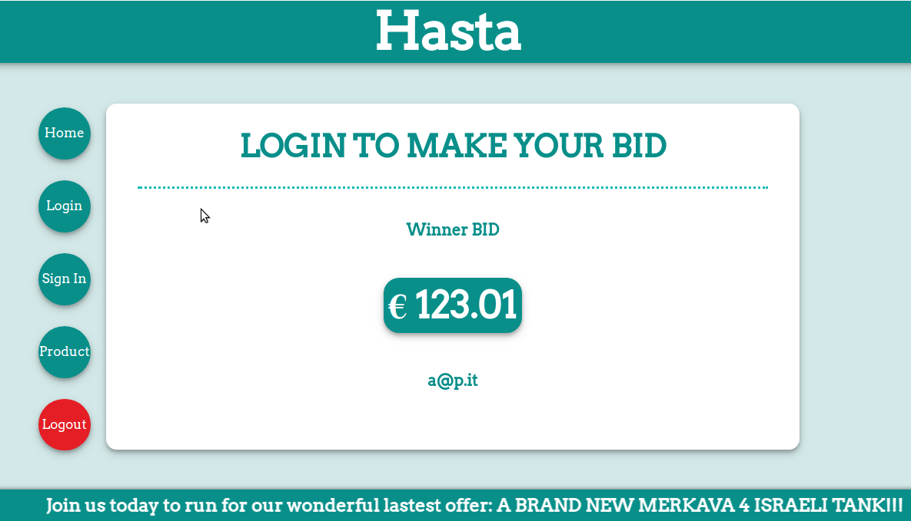

# Hasta

## Implementation of a website for online auctions 

This project represents my first experience with web technologies and is part of the course *Distributed Programming I (2017)* at **Politecnico di Torino**.

Grade: 30/30

## Authors

* **Iannino Paolo**

## License

GNU GENERAL PUBLIC LICENSE, see the [LICENSE](LICENSE) file for details.

<h3> Assignment </h3>
Build a simplified version of a website for managing online auctions. For the sake of simplicity, the web site considers
only one auction. The initial bid value is set automatically by the system.

The website must have the following features:
1. On the home page of the site, one can view the highest bid value (BID), along with
who did it.
2. Each user can sign up freely on the site by providing a username, which must be a valid email address, and a
password, which must contain at least one alphabetic character and one numeric character. A user “i”, after signing up or authenticating (if
already signed up), can set a maximum value (THR_i), greater than BID, which the user is willing to bid at auction, so
that the system automatically bids on the user’s behalf with the mechanism described below. THR_i is kept secret by
the system and is shown to the user only if authenticated. The THR_i value can be changed at any time by the
authenticated user.
3. The auction mechanism works as follows. Whenever a new value of THR_i is entered on the user's personal page, the
system automatically checks that it is greater than the current BID value, otherwise, the operation is canceled and a
special error message is displayed to the user. After having set the THR_i, the system proceeds as described in item 4 to
determine the new BID value visible to everyone, and the user is informed of the outcome of the operation ("you are the
highest bidder" or "bid exceeded").
4. Determining the new BID value: when a new value of THR_i is entered, it is compared, internally by the system,
with the THR_i values already set by other users. The user with the maximum value of THR_i is selected by the system,
and the BID value is set to the maximum of the THR_i of all users other than the selected one, adding 0.01 euros. All
the THR_i of other users will be reported, on each user's personal page, when the user is authenticated, as "bid
exceeded". If there are no other users with THR_i set, BID is left unchanged. If there are two or more users with the
same value of THR_i, the user who entered the bid first is selected and his/her THR_i becomes the new BID.
5. The system should not keep the history of operations but only the current state for each user .
6. Once authenticated, the user can continue to make THR_i settings with the procedure described above but without
the need to authenticate or sign up again. There must be a command to cancel authentication (i.e. to log out).
7. Authentication through username and password remains valid if no more than two minutes have elapsed since the last
page load. If a user attempts to perform an operation that requires authentication after an idle time of more than 2
minutes, the operation has no effect and the user is forced to re-authenticate with username and password. The use of
HTTPS must be enforced for sign up and authentication and in any part of the site that displays private information of
an authenticated user.
8. The general layout of the web pages must contain: a header in the upper part, a navigation bar on the left side with
links or buttons to carry out the possible operations and a central part which is used for the main operation.
9. Cookies and Javascript must be enabled, otherwise the website may not work properly (in that case, for what
concerns cookies, the user must be alerted and the website navigation must be forbidden, for what concerns Javascript
the user must be informed). Forms should be provided with small informational messages in order to explain the
meaning of the different fields. These messages may be put within the fields themselves or may appear when the mouse
pointer is over them.
10. The more uniform the views and the layouts are by varying the adopted browser, the better.

